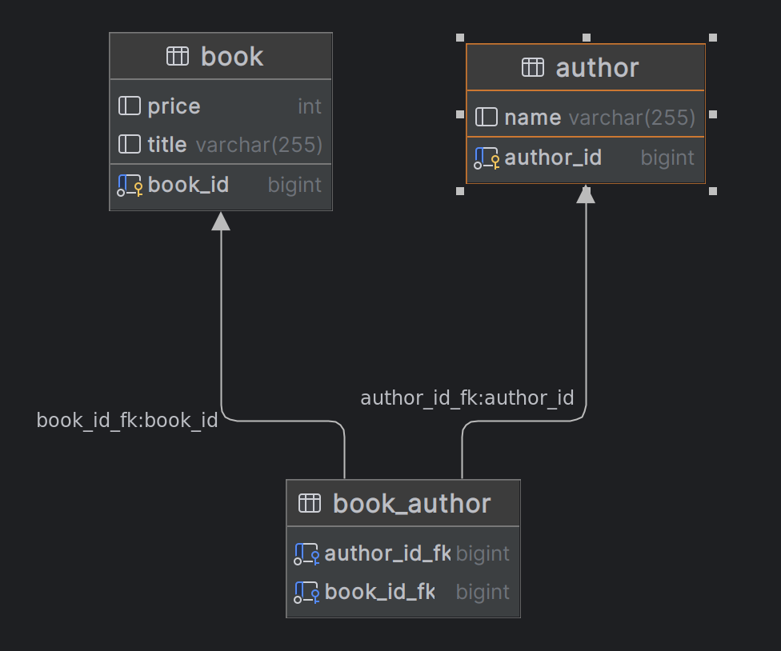

```java
@Entity(name = "book")
public class Book {

    @Id
    @GeneratedValue
    private Long book_id;
    private String title;
    private Integer price;
    // ...

    @ManyToMany
    @JoinTable(
            name = "book_author",
            joinColumns = @JoinColumn(name = "book_id_fk", referencedColumnName = "book_id"),
            inverseJoinColumns = @JoinColumn(name = "author_id_fk", referencedColumnName = "author_id")
    )
    private List<Author> authors = new ArrayList<>();
}
```

```java
@Entity(name = "author")
public class Author {

    @Id
    @GeneratedValue
    private Long author_id;
    private String name;
    // ...

    @ManyToMany(mappedBy = "authors")
    private List<Book> books = new ArrayList<>();
}
```