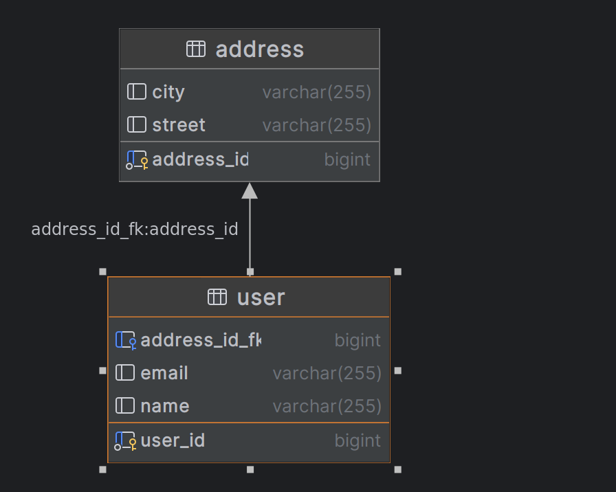

```java
@Entity(name = "user")
public class User {

    @Id
    @GeneratedValue
    private Long user_id;
    private String name;
    private String email;
    // ...

    @OneToOne
    @JoinColumn(name = "address_id_fk", referencedColumnName = "address_id")
    private Address address;
}


```

```java
@Entity(name = "address")
public class Address {

    @Id
    @GeneratedValue
    private Long address_id;
    private String street;
    private String city;
    // ...

    @OneToOne(mappedBy = "address", targetEntity = User.class)
    private User user;
}
```