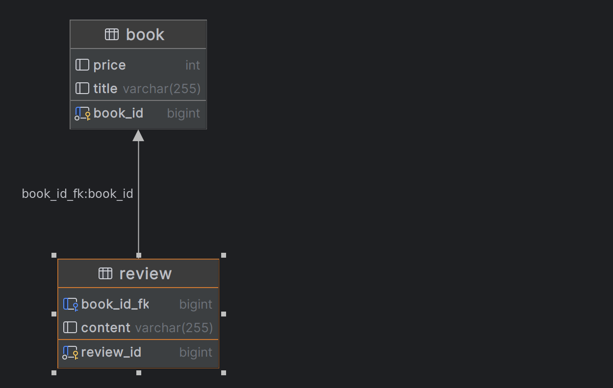

```java
@Entity(name = "book")
public class Book {

    @Id
    @GeneratedValue
    private Long book_id;
    private String title;
    private Integer price;
    // ...
}
```

```java
@Entity(name = "review")
public class Review {

    @Id
    @GeneratedValue
    private Long review_id;
    private String content;
    // ...

    @ManyToOne
    @JoinColumn(name = "book_id_fk", referencedColumnName = "book_id")
    private Book book;
}
```